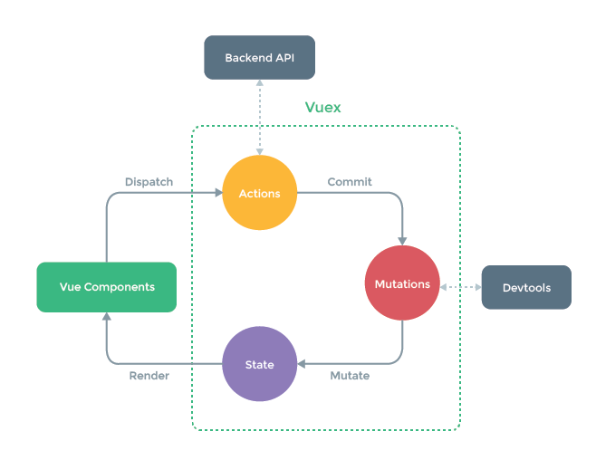

# study-vuex


vuex 공부한 내용에 대해 정리하고자 한다.

- 참고 사이트 : [VUEX Vue 3 Crash Course 2022 | VUEX Tutorial | NAVEEN SAGGAM](https://www.youtube.com/watch?v=vBMY7251-Jg) (영어 주의...)


## vuex 상태관리 프로세스 



- 출처 : [vuex공식문서](https://vuex.vuejs.org/#what-is-a-state-management-pattern)

## 언제 쓸까?

### 위 공식문서에 따르면, vuex는 다중 뷰에서 동일한 상태관리를 위해 사용된다고 볼 수 있다.

### 또한 처음 경험할 때에는 장황해 보일수 있고, 앱이 단순한 경우 vuex는 필요없을 수 있다고 설명되어 있다.


## 예제

Counter.vue : count 를 세기위한 간단한 예제

### vuex를 쓰지 않을 경우 데이터 처리를 위해 아래와 같은 모습을 가질 것이다.

```vue
<script>
// Counter.vue 일부    
export default {
  name: "Counter",
  data () {
    return {
      count:0
    }
  },
  methods: {
    clickIncrement : function() {
      this.count = this.count+1
    },
    clickDecrement : function() {
      this.count = this.count-1
    },
    clickIncrementBy : function(value) {
      this.count = this.count+value
    }
  }
}
</script>
```


### Vuex를 쓴다면 아래와 같이 data를 다룰 것이다.

```vue
<script>
// VuexCounter.vue 일부
import {mapGetters} from "vuex"

export default {
  name: "VuexCounter",
  data () {
    return {
      count:0
    }
  },
  computed: mapGetters({
    counterState: "getCounterState"
  }),
  methods: {
    clickIncrement : function() {
      this.$store.dispatch("counterModule/incrementCounter");
    },
    clickDecrement : function() {
      this.$store.dispatch("counterModule/decrementCounter");
    },
    clickIncrementBy : function(value) {
      this.$store.dispatch("counterModule/incrementCounterBy", {value: value});
    }
    
  }
}
</script>
```

this.$store.dispatch() 함수를 통해 vuex에 저장된 action(맨 위 사진 참고)을 불러올 수 있다. 


@/store/index.js 에 Store를 만든다. 

```js
// store/index.js
import { createStore } from "vuex";
import counterModule from "./modules/counter.module";

export default createStore({
  state: {
    counterState : counterModule.state
  },
  getters: {
    getCounterState : function(state){
      return state.counterState.counter;
    }
  },
  modules: {
    counterModule
  },
  //mutations: {},
  //actions: {},
});

```

counterModule로 모듈화 하여 분리시켜놓았고, 아래와 같다.

```js
// @/store/modules/conter.module.js
export default {
    namespaced : true,
    state : {
        counter : {
            count:0
        }
    },
    mutations: {
        INCR_COUNTER : function(state){
            state.counter.count = state.counter.count + 1;
        },
        DECR_COUNTER : function(state){
            state.counter.count = state.counter.count - 1;
        },
        INCR_COUNTER_BY : function(state, payload){
            state.counter.count = state.counter.count + payload.value;
        }
    },
    actions: {
        incrementCounter : function({commit}){
            return commit("INCR_COUNTER");
        },
        decrementCounter : function({commit}){
            return commit("DECR_COUNTER");
        },
        incrementCounterBy : function({commit}, payload){
            return commit("INCR_COUNTER_BY", payload);
        }
    }
}
```

state를 통해 counter.count 상태를 보관하고 있다.

actions를 통해 명령을 commit 하면 mutation에서 함수를 실행,  state가 변화한다.

막상 개념적으로 어렵진 않지만 굉장히 여러스텝을 건너야 동작이 이뤄지기에 복잡하다고 느낄수 밖에 없는듯 하다.

영상에서는 단순한 count 말고 더 다양한 예제들이 있으니 참고하자.
